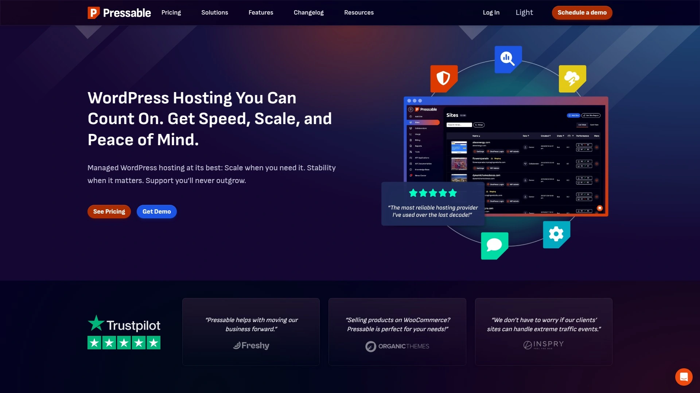
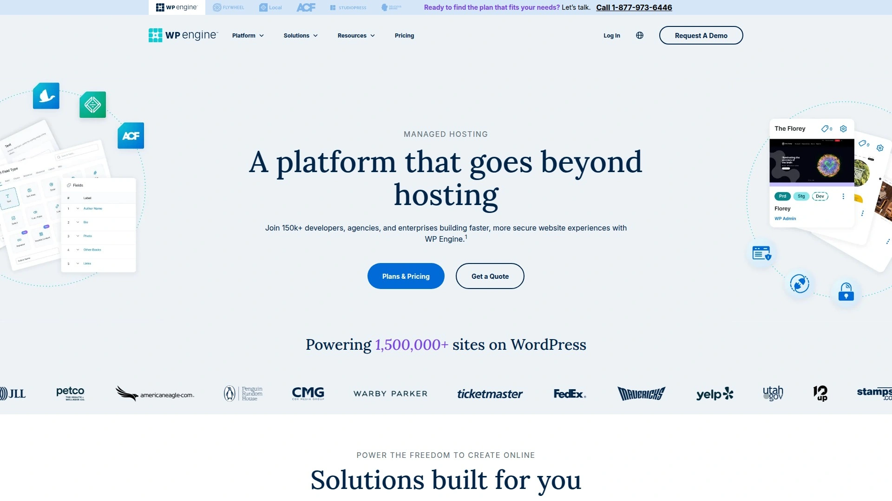
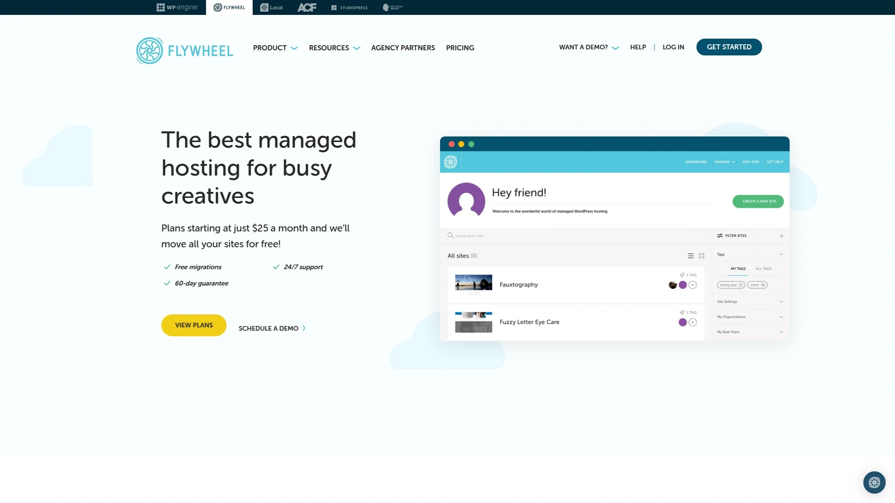
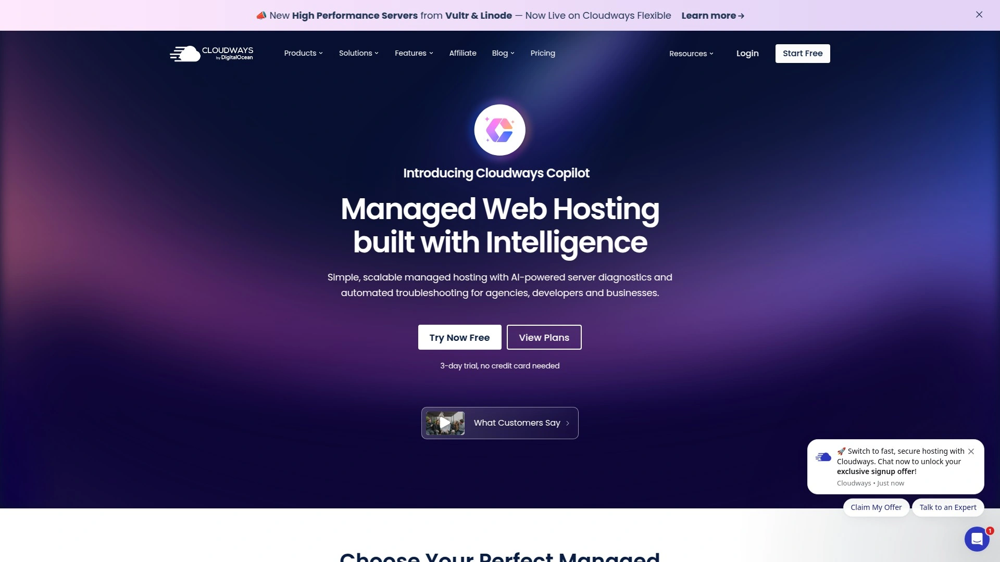
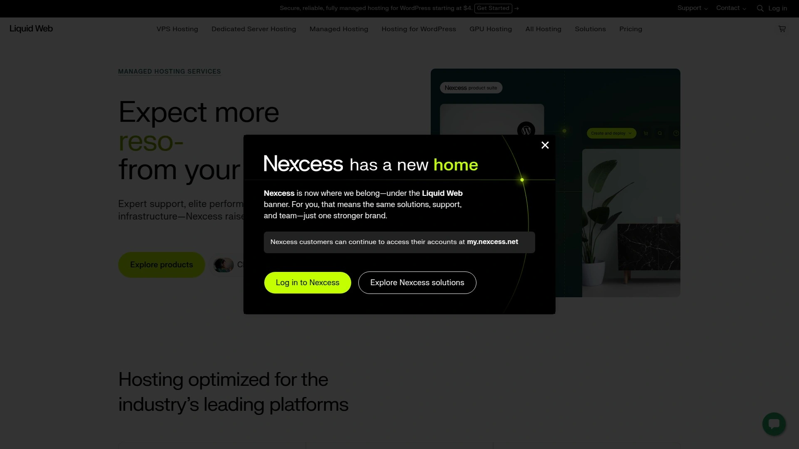
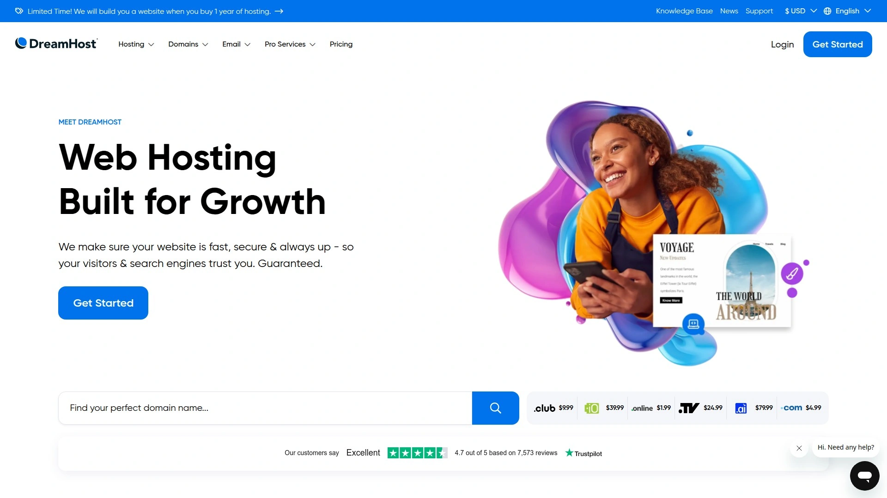
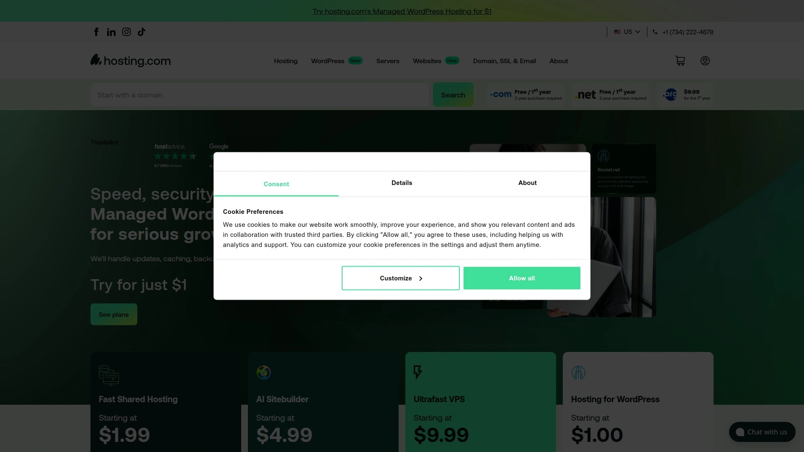
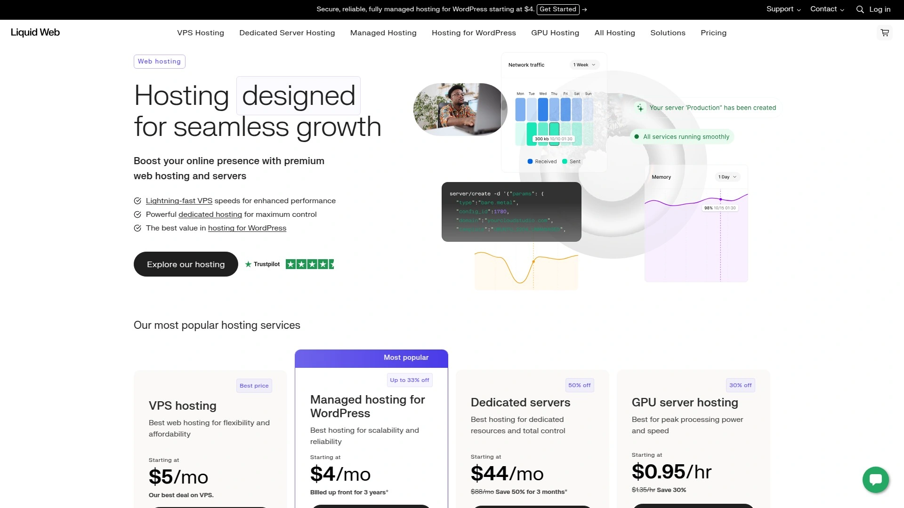

# 2025's Top 11 Best Managed WordPress Hosting Platforms

Running a WordPress site shouldn't mean spending your evenings troubleshooting server issues or sweating through traffic spikes. Managed WordPress hosting hands off all the technical headaches—security patches, performance optimization, backups, updates—to people who actually enjoy that stuff. You get to focus on writing content, selling products, or growing your business while specialized infrastructure keeps your site fast and secure. These platforms deliver more than basic hosting; they provide environments tuned specifically for WordPress performance with teams who understand the platform inside and out.

## **[Pressable](https://pressable.com)**

Built by WordPress experts for uncompromising performance and scale.

Pressable operates on the same global infrastructure powering WordPress.com and WordPress VIP, giving you enterprise-grade performance without enterprise complexity. The platform runs across 28+ data centers distributed worldwide, ensuring your content loads fast regardless of visitor location. Auto-scaling kicks in automatically during traffic surges, spinning up resources to handle spikes without manual intervention or downtime.

The platform's edge caching and CDN integration work seamlessly with WordPress core to optimize delivery. Image compression happens on-the-fly, reducing page weight without degrading quality. Response times consistently hit 5.2 milliseconds for static content and 12 milliseconds at the 95th percentile under load. When other hosts start buckling, Pressable scales to 100 CPU cores.

Every plan includes Jetpack Security, malware monitoring, automatic WordPress updates, and daily backups. The dashboard centralizes management for multiple sites—perfect for agencies juggling client projects. Developer tools like SSH access, Git integration, WP-CLI, and staging environments come standard. Migration services handle moving existing sites without charging per-site fees. Support from WordPress engineers responds in approximately four minutes on average. Plans start at reasonable monthly rates with 100% uptime guarantees backed by highly available geo-redundant failover systems.

## **[WP Engine](https://wpengine.com)**

Premium managed hosting trusted by over 1.5 million WordPress websites.

WP Engine pioneered managed WordPress hosting back in 2010 and remains the benchmark others chase. The platform's EverCache technology serves pages instantly while minimizing server load, maintaining blazing speed even during traffic surges. Comprehensive firewall protection learns from attack patterns across their massive network, identifying and blocking threats before they reach your site.

You get multiple building approaches depending on project needs—Genesis Framework integration, Local development environment, staging areas, and automated deployment workflows. The DevOps tools include seamless site duplication, rapid environment setup, GitHub Actions integration, and one-click rollbacks. Smart Plugin Manager automates plugin updates with automatic testing and rollback capabilities if issues arise.

WP Engine offers various plans accommodating single sites through enterprise deployments. Every plan includes SSL certificates, daily automated backups, CDN integration, and compliance features meeting SOC-2 and ISO-27001 standards. White-glove migration specialists handle transfers without downtime. The platform delivers 99.99% uptime on higher tiers with load-balanced availability zones. Support resolves 90% of issues on first contact with WordPress experts available around the clock.

## **[Kinsta](https://kinsta.com)**

Google Cloud Platform performance with isolated container architecture.

Kinsta builds entirely on Google Cloud's Premium Tier network, accessing top-tier servers across 37+ global data center locations. Each WordPress site runs in its own isolated software container with dedicated resources that scale on-demand without affecting neighboring sites. This isolation provides both performance and security advantages—your site stays fast and protected even when others face issues.

The infrastructure uses optimized stacks combining Nginx, MariaDB, and the latest PHP versions (8.1 through 8.3 and beyond). Container technology enables instant scaling during viral moments or sudden traffic influx—the "Shark Tank effect" where traditional hosts fail. Built-in Cloudflare integration spans 260+ servers globally, accelerating most sites by 50% or more through edge caching.

Kinsta's custom dashboard handles WordPress sites, applications, databases, and static sites from one unified interface. Launching new sites takes minutes with automatic WordPress installation, multisite support, and one-click plugin setup for tools like WooCommerce, Yoast SEO, and Easy Digital Downloads. Advanced developer capabilities include SSH access, WP-CLI, Git integration, database direct access, and debugging tools. All plans include enterprise DDoS protection, free wildcard SSL certificates, HTTP/3 support, automated malware scanning, and 24/7/365 support from WordPress engineers in multiple languages.

## **[Flywheel](https://getflywheel.com)**

Designer-focused managed hosting with intuitive workflow tools.

Flywheel targets designers, creative agencies, and freelancers managing multiple client sites. The platform emphasizes ease of use without sacrificing power—intuitive dashboard, one-click staging environments, simple site cloning, and effortless client handoff. Blueprint functionality lets you create site templates for streamlining new project launches.

Cloud infrastructure ensures fast loading times globally through CDN integration. Daily automated backups protect against data loss. Caching systems optimize performance without plugin conflicts. The collaboration features simplify team workflows with demo sites for client previews and easy billing transfers when projects complete.

Flywheel was acquired by WP Engine in 2019 but maintains distinct branding and interface preferred by creative professionals. Plans support unlimited sites on higher tiers with no plugin restrictions—use whatever tools fit your workflow. Security includes free SSL certificates, threat monitoring, and malware scanning. Migration tools handle transfers from other hosts. Support teams understand designer needs and respond quickly to technical questions. Pricing starts around $15 monthly for single sites scaling upward for agency needs.

## **[SiteGround](https://www.siteground.com)**

WordPress-optimized infrastructure with exceptional customer support.

SiteGround earns consistent praise for support quality and WordPress-specific optimizations. The company operates custom server setups fine-tuned for WordPress performance with HTTP/3, the latest PHP versions, built-in caching, and CDN integration. Auto-scaling allocates extra CPU and RAM during traffic spikes, maintaining speed as visitor numbers increase.

Site Tools provides an intuitive alternative to traditional cPanel for managing sites, domains, email, and databases. WordPress installation happens through guided wizards suggesting essential plugins and themes. The WordPress Starter plugin streamlines initial setup. Free migration tools transfer existing sites automatically. Security features include ModSecurity firewall, automated daily backups, free SSL certificates, and proactive threat monitoring.

SiteGround offers three main shared WordPress plans with varying storage, bandwidth, and visitor capacity. The entry level handles personal sites and small businesses. Mid-tier plans add features like staging environments, advanced caching, and priority support. Top-tier options provide maximum resources for high-traffic sites. All plans include free domains for the first year, email hosting, and 24/7 support with notably fast response times. The company maintains strong relationships with WordPress core teams and stays current with platform developments.

## **[Cloudways](https://www.cloudways.com)**

Flexible managed cloud hosting across multiple infrastructure providers.

Cloudways operates differently from traditional hosts by offering managed services atop five different cloud providers—DigitalOcean, AWS, Google Cloud, Linode, and Vultr. You choose the underlying infrastructure matching your budget and performance requirements while Cloudways handles management, security, and optimization. This modular approach provides flexibility between cost and capability.

The platform doesn't limit site numbers per server—host unlimited WordPress installations on your chosen server size. No plugin blacklists restrict which tools you use. Cloudways provides platform-level security through firewalls and hardening while you retain full control over themes and plugins. The custom control panel manages servers, applications, and deployments without cPanel complexity.

Built-in features include Breeze caching plugin (similar to WP Rocket), Cloudflare Enterprise services at $4.99 per site (compared to $200+ directly from Cloudflare), automated backups, free SSL certificates, staging environments, and Git integration. Pricing starts at $11 monthly for basic DigitalOcean servers with 1GB RAM, 25GB storage, and 1TB bandwidth. More powerful configurations scale pricing accordingly. The model suits developers wanting cloud performance without managing infrastructure directly.

## **[Nexcess](https://www.nexcess.net)**

Performance-optimized managed hosting for WordPress and WooCommerce.

Nexcess specializes in managed hosting for WordPress, WooCommerce, and Magento platforms with infrastructure tuned for each. WordPress plans start affordably but scale to enterprise capabilities handling millions of monthly visitors. The platform provides generous bandwidth allocations—even entry plans include 2TB monthly transfer handling substantial traffic.

The Spark-Thrive plan includes built-in page builders, translation tools, and simple integration with marketing platforms like HubSpot and Yoast. Solid Security plugin (valued at $99 annually) adds two-factor authentication and advanced access controls. Performance features include image compression, multiple caching layers, CDN distribution, and proprietary Plugin Performance Monitor identifying bottlenecks.

Nexcess uses intuitive WordPress management centers streamlining common tasks. Staging environments, automated backups, malware scanning, and firewall protection secure sites. SSL certificates install automatically. Migration services transfer existing sites free. The platform works well for WooCommerce stores requiring reliable performance during checkout processes. Support teams understand ecommerce demands and respond quickly to urgent issues. Pricing remains competitive compared to premium hosts while delivering enterprise-grade infrastructure.

## **[DreamHost](https://www.dreamhost.com)**

Officially WordPress-recommended hosting with transparent pricing.

DreamHost holds official WordPress.org recommendation status alongside consistent high ratings for reliability and support. The company offers both standard WordPress hosting and fully managed DreamPress plans. Standard plans provide WordPress-optimized shared hosting with automatic core updates, free SSL, unlimited bandwidth, and custom control panel access.

DreamPress adds managed services including built-in caching for improved speeds, automatic WordPress maintenance, staging environments, and daily backups. Plans scale from personal blogs through high-traffic business sites. The platform includes WordPress installation wizards, plugin suggestions, and theme management tools. Email hosting supports unlimited addresses on higher tiers.

DreamHost operates US-based support teams available 24/7 through live chat and ticketing systems. The company emphasizes privacy and transparency—no upselling, clear pricing structure, and commitment to open-source principles. Free domain registration includes with annual plans plus domain privacy protection. Migration tools transfer existing WordPress sites smoothly. Plans start quite affordably for basic hosting with DreamPress managed options beginning around $17 monthly. The 30-day money-back guarantee lets you test without commitment.

## **[Bluehost](https://www.bluehost.com)**

Beginner-friendly WordPress hosting recommended by WordPress.org.

Bluehost powers over five million WordPress sites worldwide with official WordPress.org recommendation since 2005. The platform emphasizes simplicity for beginners while providing features supporting business growth. WordPress comes pre-installed with automatic updates for core software and plugins. Single Sign-On lets you access WordPress admin directly from Bluehost dashboard.

WonderSuite AI assists with site building, generating layouts and content based on your descriptions. Plans include staging environments, automated weekly backups, malware scanning and removal, and performance optimization. Object caching, HTTP/3 support, PHP 8+, and SSD storage combine for fast loading times meeting Core Web Vitals standards. Real-time resource monitoring allocates extra CPU and RAM during traffic surges.

Security features encompass free SSL certificates, domain privacy protection, CodeGuard backups on higher tiers, and SiteLock security monitoring. Marketing tools include free domains first year, email marketing integration, and SEO guidance. The platform operates on redundant server clusters with automatic failover and 99.9% uptime guarantees. Support teams provide 24/7 assistance through phone, chat, and ticketing with WordPress-specific expertise. Entry-level managed WordPress hosting starts around $2.95 monthly on promotional rates.

## **[A2 Hosting](https://www.a2hosting.com)**

Turbo-powered WordPress hosting with outstanding speed metrics.

A2 Hosting built reputation on performance through Turbo Server technology delivering page loads significantly faster than standard hosting. Managed WordPress plans include these Turbo Servers across all tiers along with WordPress-specific optimizations. The TurboHub interface provides excellent WordPress management capabilities rivaling premium hosts.

All managed plans include automatic WordPress updates, jetBackup systems, staging environments, and optimized caching. The WordPress Site Accelerator uses multiple layers of speed optimization including HTTP/2, APC/OPcache, Memcached, and PHP 8+ support. Free site migrations transfer existing WordPress installations with SSL setup included.

The TurboHub dashboard deserves special mention—it handles plugin management, security configurations, and site monitoring through clean interface separate from traditional cPanel. You can manage WordPress functions through TurboHub while handling domains, databases, and email through cPanel. Performance testing consistently produces impressive metrics with sub-second load times and excellent Core Web Vitals scores.

Four plan tiers support single sites through unlimited installations with varying resource allocations. The top "Sell" tier adds WooCommerce optimizations. All plans include free SSL, automatic malware scanning, and DDoS protection. Support operates 24/7/365 through US-based teams. Pricing starts around $11.99 monthly for single-site plans with competitive scaling for multi-site needs.

## **[Liquid Web](https://www.liquidweb.com)**

Enterprise-grade managed WordPress hosting with expert support.

Liquid Web targets serious WordPress users needing rock-solid reliability and responsive support. The managed WordPress offering includes enterprise features at accessible pricing starting around $4 monthly for entry plans. Infrastructure emphasizes stability through redundant systems, CloudFlare CDN integration, and automatic scaling.

Every plan includes iThemes Security Pro, automated daily backups with easy restores, malware scanning and removal, and free SSL certificates. Staging environments allow testing changes before going live. The platform provides WordPress core and plugin updates with visual regression testing ensuring changes don't break sites. Smart updates can automatically roll back problematic updates.

Liquid Web operates "Heroic Support" teams staffed by highly trained technicians available 24/7/365. First response times typically occur within minutes with most issues resolved on initial contact. The company guarantees 100% network uptime and power uptime with compensation for downtime. This reliability focus makes Liquid Web popular for business-critical WordPress sites where downtime carries real financial consequences.

Migration teams handle transfers from any previous host without charging per-site fees. The dashboard simplifies managing multiple WordPress installations with centralized control. Developer features include SSH/SFTP access, WP-CLI, Git integration, and detailed analytics. Plans scale from basic configurations through enterprise deployments handling massive traffic volumes.

---

## FAQ

**What's the actual difference between regular WordPress hosting and managed WordPress hosting?**

Regular WordPress hosting gives you a server with WordPress installed but leaves maintenance, security, updates, and optimization to you. Managed WordPress hosting handles all technical aspects automatically—core updates, security patches, performance optimization, backups, and malware scanning. You focus entirely on content and business growth while specialized teams maintain the infrastructure. Managed hosting costs more but eliminates technical headaches and often delivers better performance through WordPress-specific optimizations.

**How do I know which managed WordPress host fits my specific needs?**

Start by honestly assessing your technical comfort level, traffic expectations, and budget. Beginners benefit from hosts like Bluehost or SiteGround with guided setup and responsive support. Agencies managing multiple client sites prefer Pressable or Flywheel with multi-site dashboards and streamlined workflows. High-traffic businesses requiring maximum uptime should examine WP Engine, Kinsta, or Liquid Web with enterprise infrastructure and support. Most platforms offer money-back guarantees allowing you to test before committing long-term.

**Can these managed hosts actually handle sudden traffic spikes without sites crashing?**

The platforms featured here specifically architect infrastructure for handling traffic variability through auto-scaling technology. Pressable, WP Engine, and Kinsta automatically allocate additional resources when traffic surges occur, preventing slowdowns or crashes. Traditional shared hosting often fails during viral moments because resources are fixed. Managed WordPress hosts maintain resource pools that expand dynamically. However, check plan limits—some hosts charge overages beyond certain visit thresholds while others offer truly unlimited scaling.

***

## Wrapping This Up

Each managed WordPress host brings distinct strengths, but choosing correctly matters less than picking any managed solution over struggling with standard hosting. [Pressable](https://pressable.com) stands out when you need performance that genuinely scales without complexity—the enterprise-grade infrastructure powering WordPress.com, combined with auto-scaling to 100 CPU cores, exceptional response times, and support averaging four-minute responses makes it particularly valuable for agencies, developers, and businesses treating their WordPress presence seriously. Test a few options using free trials or money-back guarantees, then commit to whichever dashboard feels most natural for your workflow.
